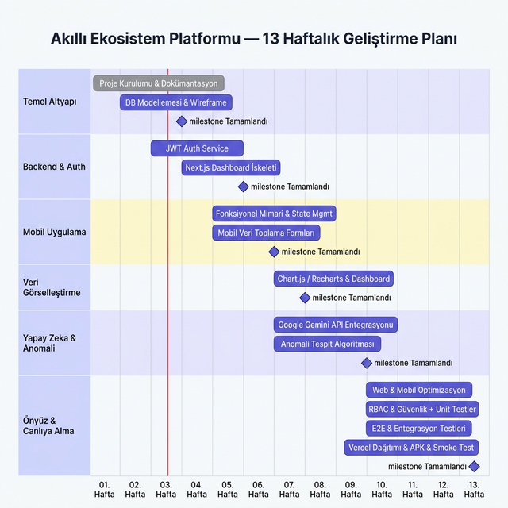

# EcoSync AI — Akıllı Ekosistem Platformu

> **Geliştirici:** Mehmet Sefa İmamoğlu — Yazılım Mühendisliği 3. Sınıf Dönem Projesi  
> **Başlangıç Tarihi:** 25 Şubat 2026 &nbsp;|&nbsp; **Bitiş Tarihi:** 26 Mayıs 2026

Enerji (elektrik, gaz) ve su tüketimini gerçek zamanlı izleyen, Google Gemini API destekli anomali tespiti yapan ve kullanıcılara kişiselleştirilmiş sürdürülebilirlik tavsiyeleri sunan çok platformlu akıllı ekosistem platformu.

> 🚨 **Yeni — Hafta 5:** Kural tabanlı anomali tespit algoritması devreye alındı! Elektrik > 200 kWh, Su > 100 L veya Gaz > 50 m³ eşik değerlerini aşan her tüketim kaydı otomatik olarak `anomalies` tablosuna yazılıyor; Flutter Dashboard'da turuncu uyarı kartı, Next.js Web Paneli'nde kırmızı rozet + detaylı anomali listesi olarak görüntüleniyor. ✅

---

## 📁 Proje Yapısı

```
akilli-ekosistem-platformu/
│
├── web_paneli/                  # Next.js 14 — App Router + Tailwind CSS
│   ├── src/
│   │   ├── app/                 # Sayfalar (login, dashboard, anomalies...)
│   │   ├── components/          # Yeniden kullanılabilir UI bileşenleri
│   │   └── lib/                 # Supabase & Gemini client utilities
│   ├── .env.example             # Ortam değişkeni şablonu
│   └── package.json
│
├── mobil_uygulama/              # Flutter 3 — Riverpod + Clean Architecture
│   ├── lib/
│   │   ├── main.dart            # Giriş noktası (ProviderScope + Supabase init)
│   │   ├── core/                # Sabitler, hata türleri, router, tema
│   │   ├── models/              # Domain modeller (User, Consumption, Anomaly)
│   │   └── features/            # Feature-first modüler yapı
│   │       ├── auth/            # Giriş / Kayıt (data + domain + presentation)
│   │       ├── dashboard/       # Ana panel (fl_chart BarChart entegre ✅)
│   │       ├── consumption/     # Tüketim CRUD — form, repository, Riverpod ✅
│   │       └── anomaly/         # Kural tabanlı anomali tespiti, repository, Riverpod provider ✅
│   ├── pubspec.yaml             # Flutter bağımlılıkları
│   └── .env.example             # Ortam değişkeni şablonu
│
└── dokumanlar/                  # Proje dokümantasyonu
    ├── gantt_diyagrami.png      # 13 haftalık geliştirme planı
    ├── sistem_mimarisi.md       # Mimari diyagramlar ve veri akışı
    ├── tech_stack.md            # Teknoloji seçimleri ve gerekçeleri
    ├── domain_model.md          # İş kuralları, varlıklar, use case'ler
    ├── veritabani_semasi.md     # SQL şeması, ER diyagramı, RLS politikaları
    └── ui_ux_rehberi.md         # Wireframe rehberi ve Figma kılavuzu
```

---

## 🗓️ 13 Haftalık Geliştirme Planı



### ✅ Tamamlanan Haftalar

| Hafta | Konu | Durum |
|-------|------|-------|
| Hafta 1–2 | Proje kurulumu, Next.js + Flutter iskelet, Supabase şeması, dokümantasyon | ✅ Tamamlandı |
| Hafta 3 | Auth entegrasyonu (Supabase JWT), GoRouter, login/register akışı | ✅ Tamamlandı |
| Hafta 4 | Tüketim verisi CRUD (Flutter Riverpod + Supabase), `fl_chart` BarChart (mobil), Recharts AreaChart (web), Server-side dashboard veri çekme | ✅ Tamamlandı |
| Hafta 5 | **Kural tabanlı anomali tespit algoritması** — Flutter `AnomalyRepository` + `anomaly_provider`, Supabase `anomalies` tablosu, turuncu uyarı kartları (mobil) ve `AnomalyList` bileşeni (Next.js web paneli) | ✅ Tamamlandı |
| Hafta 6–13 | Gemini AI entegrasyonu, bildirimler, raporlama, deployment | 🔲 Planlandı |

---

## ⚙️ Teknoloji Yığını

| Katman | Teknoloji | Açıklama |
|--------|-----------|----------|
| Web Frontend | Next.js 14 (App Router) + TypeScript | SSR, API Routes (Gemini proxy) |
| Mobil | Flutter + Dart | iOS & Android — tek kod tabanı |
| State Yönetimi | Riverpod 2 | Compile-time güvenli reaktif state |
| Navigasyon | GoRouter | Bildirimsel routing, deep link |
| Backend/Auth | Supabase (PostgreSQL + JWT) | BaaS — Auth, Realtime, Storage |
| Yapay Zeka | Google Gemini API (gemini-1.5-flash) | Anomali açıklama, öneri üretme |
| Grafik | fl_chart (mobil) / Recharts (web) | Tüketim trend grafikleri ✅ Hafta 4'te entegre edildi |
| Anomali Motoru | Kural tabanlı eşik algoritması (Dart + TypeScript) | Elektrik/Su/Gaz aşım tespiti ✅ Hafta 5'te entegre edildi |
| Dağıtım | Vercel (web) / Firebase (mobil test) | CI/CD entegrasyon |

---

## 🚀 Başlangıç Kılavuzu

### Web Paneli

```bash
cd web_paneli

# Bağımlılıkları yükle
npm install

# Ortam değişkenlerini hazırla
cp .env.example .env.local
# .env.local dosyasını düzenleyerek gerçek API anahtarlarını girin

# Geliştirme sunucusunu başlat
npm run dev
# → http://localhost:3000
```

### Mobil Uygulama

```bash
cd mobil_uygulama

# Ortam değişkenlerini hazırla
cp .env.example .env
# .env dosyasını düzenleyerek gerçek API anahtarlarını girin

# Bağımlılıkları yükle
flutter pub get

# Kod üretimi (Riverpod, Freezed)
dart run build_runner build --delete-conflicting-outputs

# Uygulamayı çalıştır (emülatör veya fiziksel cihaz gerekli)
flutter run
```

---

## 🔐 Ortam Değişkenleri Yönetimi

Her iki platform için ayrı `.env.example` şablon dosyaları mevcuttur:

| Dosya | Platform | Kopyalanacak Ad |
|-------|----------|-----------------|
| `web_paneli/.env.example` | Next.js | `.env.local` |
| `mobil_uygulama/.env.example` | Flutter | `.env` |

### Gerekli Ortam Değişkenleri

| Değişken | Kullanım | Nereden Alınır |
|----------|---------|----------------|
| `NEXT_PUBLIC_SUPABASE_URL` | Supabase proje URL'si | Supabase Dashboard > Project Settings |
| `NEXT_PUBLIC_SUPABASE_ANON_KEY` | Anonim (public) API anahtarı | Supabase Dashboard > API |
| `SUPABASE_SERVICE_ROLE_KEY` | Sunucu tarafı yetki (sadece API Route) | Supabase Dashboard > API |
| `GEMINI_API_KEY` | Google Gemini AI | [Google AI Studio](https://aistudio.google.com/app/apikey) |

### ⚠️ Güvenlik Kuralları

1. **`.env.local` ve `.env` dosyalarını asla Git'e commit etmeyin** — Bu dosyalar `.gitignore`'a eklenmiştir.
2. `SUPABASE_SERVICE_ROLE_KEY` ve `GEMINI_API_KEY` yalnızca **sunucu tarafında** (Next.js API Routes) kullanılmalıdır.
3. Flutter mobil uygulamasında Gemini API anahtarı doğrudan kullanmak yerine **Next.js API Route proxy** üzerinden çağrı yapılması önerilir.
4. Üretim ortamı anahtarlarını Vercel / CI/CD sistem ortam değişkenleri üzerinden yönetin.

---

## 📚 Dokümantasyon

| Belge | İçerik |
|-------|--------|
| [Sistem Mimarisi](dokumanlar/sistem_mimarisi.md) | Mimari diyagramlar, katmanlar, veri akışı |
| [Tech Stack](dokumanlar/tech_stack.md) | Teknoloji seçimleri ve karşılaştırmalar |
| [Domain Model](dokumanlar/domain_model.md) | İş kuralları, varlıklar, repository arayüzleri |
| [Veritabanı Şeması](dokumanlar/veritabani_semasi.md) | SQL DDL, ER diyagramı, RLS politikaları |
| [UI/UX Rehberi](dokumanlar/ui_ux_rehberi.md) | Wireframe şablonları, Figma kılavuzu |

---

## ⚠️ Riskler ve Önlemler

| Risk | Etki | Olasılık | Azaltma Stratejisi |
|------|------|----------|--------------------|
| Yapay Zeka API Limitleri | İsteklerin reddedilmesi | Orta | Asenkron yönetim + response caching |
| Fonksiyonel State Hataları | Veri tutarsızlıkları | Orta | Riverpod immutable state + unit testler |
| Platformlar Arası Uyumluluk | Senkronizasyon gecikmesi | Düşük | Supabase realtime listener mimarisi |
| Flutter CLI Eksikliği | Mobil uygulama çalıştırılamaz | Düşük | [Flutter kurulum rehberi](https://docs.flutter.dev/get-started/install) |

