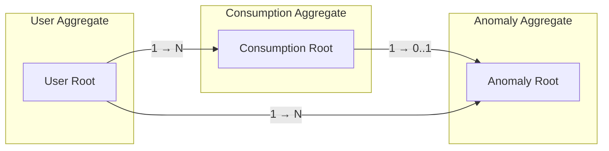

# Domain Model — EcoSync AI

> **Proje:** EcoSync AI (Akıllı Ekosistem Platformu)  
> **Versiyon:** 1.0.0  
> **Tarih:** Mart 2026  
> **Hazırlayan:** Mehmet Sefa İmamoğlu

---

## 1. Giriş

Bu belge, EcoSync AI projesinin iş kurallarını (business rules), domain bileşenlerini ve Clean Architecture prensiplerine göre yapılandırılmış katmanları açıklamaktadır. Domain-Driven Design (DDD) terminolojisi kullanılmıştır.

---

## 2. Domain Kavramları ve Varlıklar (Entities)

### 2.1 User (Kullanıcı)

Platforma kayıtlı bireysel kullanıcıyı temsil eder.

```
User
├── id            : UUID (PK)
├── email         : String (unique, zorunlu)
├── full_name     : String (opsiyonel)
├── avatar_url    : String (opsiyonel)
├── role          : Enum { user, admin }
└── created_at    : Timestamp
```

**İş Kuralları:**
- Bir kullanıcı yalnızca kendi tüketim verilerini görebilir (RLS).
- `admin` rolüne sahip kullanıcılar tüm anomali raporlarına erişebilir.
- E-posta adresi benzersiz olmalıdır.

---

### 2.2 Consumption (Tüketim Kaydı)

Belirli bir enerji/su kaynağının belirli bir zaman noktasındaki ölçüm kaydını temsil eder.

```
Consumption
├── id            : UUID (PK)
├── user_id       : UUID (FK → User)
├── type          : Enum { electricity, water, gas }
├── value         : Float (tüketim miktarı)
├── unit          : String { 'kWh', 'litre', 'm³' }
├── recorded_at   : Timestamp
└── notes         : String (opsiyonel)
```

**İş Kuralları:**
- `value` sıfırdan büyük olmalıdır.
- `unit` ile `type` tutarlı olmalıdır (elektrik → kWh, su → litre, gaz → m³).
- Geçmişe dönük kayıt eklenebilir; `recorded_at` serbest zaman damgasıdır.
- Anomali tespiti her yeni kayıt eklendiğinde otomatik tetiklenir.

---

### 2.3 Anomaly (Anomali)

AI destekli analiz sonucu tespit edilen anormal tüketim olayını temsil eder.

```
Anomaly
├── id                   : UUID (PK)
├── user_id              : UUID (FK → User)
├── consumption_id       : UUID (FK → Consumption)
├── description          : String
├── severity             : Enum { low, medium, high, critical }
├── status               : Enum { open, acknowledged, resolved }
├── detected_value       : Float
├── expected_value       : Float
├── gemini_explanation   : Text (Gemini API yanıtı)
├── detected_at          : Timestamp
└── resolved_at          : Timestamp (nullable)
```

**İş Kuralları:**
- Bir `Consumption` kaydına en fazla bir aktif anomali bağlı olabilir.
- `status: resolved` iken `resolved_at` boş olamaz.
- `severity: critical` anomaliler anlık bildirim (push notification) tetikler.
- Kapatılmış (`resolved`) anomali yeniden açılamaz.

---

## 3. Aggregate Sınırları



---

## 4. Repository Arayüzleri (Domain Katmanı)

```dart
// Soyut repo — domain katmanında tanımlanır, data katmanında implement edilir

abstract class IUserRepository {
  Future<Result<UserModel>> getCurrentUser();
  Future<Result<UserModel>> updateProfile(UserModel user);
}

abstract class IConsumptionRepository {
  Future<Result<List<ConsumptionModel>>> getConsumptions({
    required String userId,
    DateTimeRange? range,
    ConsumptionType? type,
  });
  Future<Result<ConsumptionModel>> addConsumption(ConsumptionModel consumption);
}

abstract class IAnomalyRepository {
  Future<Result<List<AnomalyModel>>> getAnomalies({
    required String userId,
    AnomalyStatus? status,
    AnomalySeverity? severity,
  });
  Future<Result<void>> acknowledgeAnomaly(String anomalyId);
  Future<Result<void>> resolveAnomaly(String anomalyId);
}
```

---

## 5. Use Cases (Domain İş Kuralları)

| Use Case | Girdi | Çıktı | Açıklama |
|----------|-------|-------|----------|
| `AddConsumptionUseCase` | ConsumptionModel | Result\<ConsumptionModel\> | Tüketim kaydı ekler, validasyon yapar |
| `GetConsumptionHistoryUseCase` | userId, tarih aralığı | Result\<List\<Consumption\>\> | Filtrelenmiş tüketim geçmişi |
| `DetectAnomalyUseCase` | ConsumptionModel | Result\<Anomaly?\> | Eşik tabanlı anomali tespiti |
| `GetAnomalyReportUseCase` | anomalyId | Result\<AnomalyModel\> | Gemini açıklamasıyla tam rapor |
| `ResolveAnomalyUseCase` | anomalyId | Result\<void\> | Anomaliyi kapatır |
| `SignInUseCase` | email, password | Result\<UserModel\> | JWT ile oturum açma |
| `SignOutUseCase` | — | Result\<void\> | Oturumu kapatır |

---

## 6. Domain Olayları (Domain Events)

| Olay | Tetikleyici | Abone |
|------|------------|-------|
| `ConsumptionRecorded` | Yeni tüketim eklendi | AnomalyDetector |
| `AnomalyDetected` | Eşik aşıldı | NotificationService, GeminiExplainer |
| `AnomalyResolved` | Kullanıcı kapattı | Dashboard Güncelleme |
| `UserSignedIn` | Başarılı giriş | SessionManager |

---

## 7. İş Kuralı Özeti

1. **Veri Sahipliği:** Her tüketim kaydı ve anomali tek bir kullanıcıya aittir.
2. **Anomali Tetikleme:** Anomali tespiti senkron değil asenkron çalışır (tetikleyici mekanizması).
3. **AI Açıklama:** Gemini API çağrısı başarısız olursa anomali yine de kaydedilir (graceful degradation).
4. **Immutable History:** Geçmiş tüketim kayıtları silinemez; yalnızca notlar güncellenebilir.
5. **Threshold Yönetimi:** Eşik değerleri admin panelinden yapılandırılabilir olmalıdır (gelecek geliştirme).
