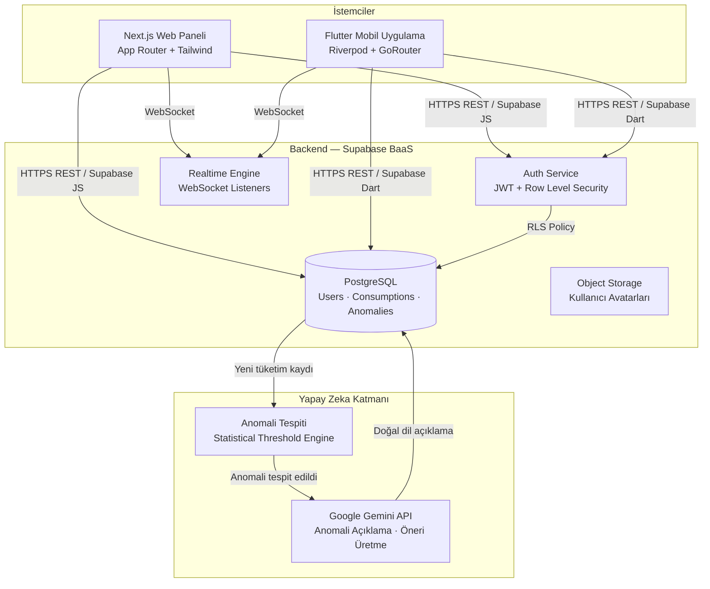
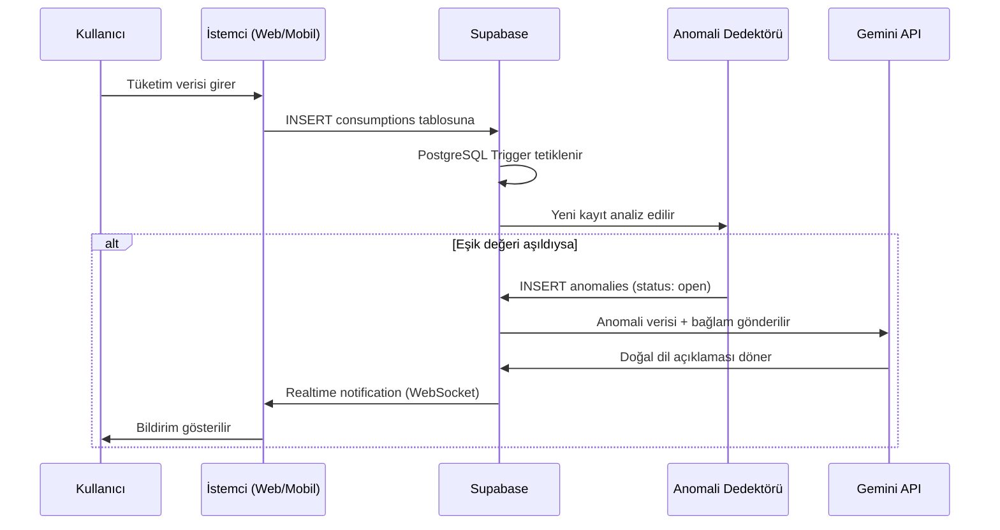
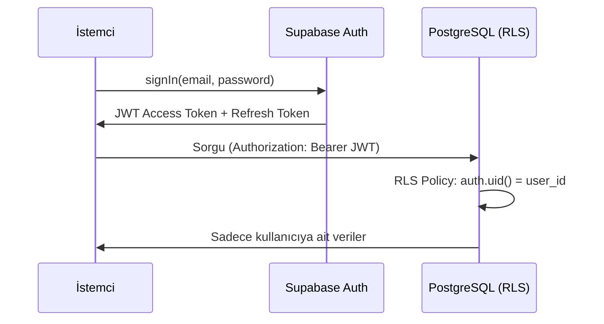

# Sistem Mimarisi — EcoSync AI

> **Proje:** EcoSync AI (Akıllı Ekosistem Platformu)  
> **Versiyon:** 1.0.0  
> **Tarih:** Mart 2026  
> **Hazırlayan:** Mehmet Sefa İmamoğlu

---

## 1. Genel Bakış

EcoSync AI, kullanıcıların enerji (elektrik, gaz) ve su tüketimlerini gerçek zamanlı olarak izlemelerine, yapay zeka destekli anomali tespiti sayesinde anormal tüketim kalıplarını tespit etmelerine ve kişiselleştirilmiş sürdürülebilirlik tavsiyeleri almalarına olanak tanıyan, çok platformlu (web + mobil) bir uygulamadır.

---

## 2. Yüksek Seviye Mimari

Sistem, birbirinden bağımsız iki istemci (Next.js Web Paneli ve Flutter Mobil Uygulaması), ortak bir backend servisi (Supabase BaaS), bir AI işlemci katmanı (Google Gemini API) ve gerçek zamanlı veri akışından oluşmaktadır.



---

## 3. Katmanlı Mimari

### 3.1 Web Paneli (Next.js)

```
web_paneli/src/
├── app/                    # Next.js App Router
│   ├── (auth)/             # Authentication route group
│   │   ├── login/
│   │   └── register/
│   ├── (dashboard)/        # Korunan rotalar
│   │   ├── dashboard/      # Ana panel
│   │   ├── consumptions/   # Tüketim yönetimi
│   │   ├── anomalies/      # Anomali raporları
│   │   └── settings/       # Kullanıcı ayarları
│   ├── api/                # Next.js API Routes (Gemini proxy)
│   │   └── ai/
│   │       └── analyze/
│   ├── layout.tsx
│   └── globals.css
├── components/
│   ├── ui/                 # Yeniden kullanılabilir primitives
│   ├── charts/             # Recharts bileşenleri
│   └── layout/             # Navbar, Sidebar, Footer
├── lib/
│   ├── supabase/           # Supabase client ve helpers
│   └── gemini/             # Gemini API client
└── types/                  # TypeScript tip tanımları
```

### 3.2 Mobil Uygulama (Flutter — Clean Architecture)

```
mobil_uygulama/lib/
├── main.dart
├── core/
│   ├── constants/          # AppConstants, API key isimleri
│   ├── errors/             # Exception sınıfları, Result<T>
│   ├── network/            # Dio client, interceptors
│   ├── router/             # GoRouter konfigürasyonu
│   └── theme/              # Material 3 tema tanımları
├── models/                 # Saf data modelleri (UserModel vb.)
└── features/
    ├── auth/
    │   ├── data/           # SupabaseAuthDataSource, AuthRepository impl.
    │   ├── domain/         # AuthRepository (abstract), Use Cases
    │   └── presentation/   # LoginPage, RegisterPage, Riverpod providers
    ├── dashboard/
    │   ├── data/
    │   ├── domain/
    │   └── presentation/   # DashboardPage, tüketim grafikleri
    └── anomaly/
        ├── data/
        ├── domain/
        └── presentation/   # AnomalyListPage, AnomalyDetailPage
```

---

## 4. Veri Akışı

### 4.1 Tüketim Kaydı ve Anomali Tespiti



### 4.2 Kimlik Doğrulama Akışı



---

## 5. Güvenlik Mimarisi

| Katman | Mekanizma | Açıklama |
|--------|----------|----------|
| Kimlik Doğrulama | Supabase Auth / JWT | Kısa ömürlü access token (1 saat) + refresh token |
| Veri İzolasyonu | Row Level Security (RLS) | Her kullanıcı sadece kendi verisini okuyabilir |
| API Güvenliği | Server-side Proxy (Next.js API Route) | Gemini API key istemciye açık değil |
| Transport | HTTPS / TLS 1.3 | Tüm iletişim şifreli |
| Ortam Değişkenleri | `.env` (gitignore'd) | Secrets asla kaynak kodda değil |

---

## 6. Ölçeklenebilirlik Notları

- **Supabase**, PostgreSQL üzerinde çalışır ve yatay ölçekleme için Connection Pooler (PgBouncer) destekler.
- **Next.js** uygulaması Vercel edge network üzerinde dağıtılır; statik sayfalar CDN'den sunulur.
- **Flutter** mobil uygulaması offline-first yaklaşımla tasarlanmıştır; bağlantı kesildiğinde yerel cache (`SharedPreferences`) kullanılır.
- **Gemini API** çağrıları asenkron kuyruğa alınarak `rate limit` yönetimi sağlanabilir.
