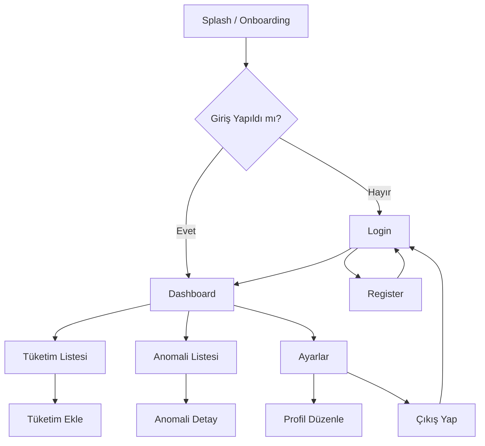

# UI/UX Rehberi — EcoSync AI

> **Proje:** EcoSync AI (Akıllı Ekosistem Platformu)  
> **Versiyon:** 1.0.0  
> **Tarih:** Mart 2026  
> **Hedef:** Figma wireframe çizim rehberi  
> **Hazırlayan:** Mehmet Sefa İmamoğlu

---

## 1. Tasarım Sistemi

### 1.1 Renk Paleti

| Token | Hex | Kullanım |
|-------|-----|----------|
| `primary` | `#00BFA5` | Ana butonlar, aktif ikonlar, vurgu |
| `primary-dark` | `#00897B` | Hover durumu |
| `secondary` | `#1565C0` | İkincil eylemler, linkler |
| `surface` | `#FFFFFF` | Kart arkaplanı (Light) |
| `background` | `#F8FAF9` | Sayfa arkaplanı (Light) |
| `on-surface` | `#1A1A2E` | Birincil metin |
| `success` | `#43A047` | Düşük tüketim göstergesi |
| `warning` | `#FB8C00` | Orta anomali uyarısı |
| `error` | `#E53935` | Kritik anomali |

**Dark Mode karşılıkları:**
- `surface` → `#1E1E2E`
- `background` → `#0D0D1A`

### 1.2 Tipografi

| Seviye | Font | Boyut | Ağırlık | Kullanım |
|--------|------|-------|---------|----------|
| Display | Inter | 32px | 700 | Onboarding başlıkları |
| Headline M | Inter | 24px | 700 | Sayfa başlıkları |
| Title | Inter | 18px | 600 | Kart başlıkları, bölüm adları |
| Body | Inter | 14px | 400 | Normal metin, açıklamalar |
| Label | Inter | 12px | 500 | Buton etiketi, chip metni |
| Caption | Inter | 11px | 400 | Zaman damgaları, meta veri |

### 1.3 Aralık ve Izgara

- **8px grid sistemi:** Tüm margin/padding 8'in katları (8, 16, 24, 32, 48px)
- **Kart köşe yarıçapı:** 16px
- **Buton köşe yarıçapı:** 12px (filled), 8px (outlined)
- **Yatay sayfa kenar boşluğu:** 16px (mobil), 24px (tablet/web sidebar)

### 1.4 İkonografi

- **Web:** [Heroicons](https://heroicons.com/) veya Lucide Icons
- **Mobil:** Material Symbols (filled variant)

---

## 2. Ekran Kataloğu

---

### 📱 EKRAN 1 — Giriş (Login)

**Navigasyon:** Uygulama başlangıç ekranı  
**Amaç:** Kullanıcı kimlik doğrulaması

```
┌────────────────────────────┐
│                            │
│      🌿  [EcoSync Logo]    │
│      EcoSync AI            │
│    Akıllı Ekosistem Plt.   │
│                            │
│  ┌──────────────────────┐  │
│  │ E-posta              │  │
│  └──────────────────────┘  │
│                            │
│  ┌──────────────────────┐  │
│  │ Şifre          [👁]  │  │
│  └──────────────────────┘  │
│                            │
│  ┌──────────────────────┐  │
│  │     GİRİŞ YAP        │  │  ← Primary filled button
│  └──────────────────────┘  │
│                            │
│  Hesabın yok mu? Kayıt ol  │  ← TextButton → Register
│  Şifremi Unuttum           │  ← TextButton → Reset
│                            │
└────────────────────────────┘
```

**Bileşenler:**
- Logo + uygulama ismi (statik)
- `TextFormField` — E-posta (keyboard: emailAddress)
- `TextFormField` — Şifre (obscureText, eye toggle)
- `FilledButton` — Giriş Yap (loading state: `CircularProgressIndicator`)
- `TextButton` — Kayıt ol (→ Register)
- `TextButton` — Şifremi Unuttum (→ Reset)

**Validasyon:**
- E-posta: Boş olamaz, geçerli e-posta formatı
- Şifre: Min 6 karakter

---

### 📱 EKRAN 2 — Kayıt (Register)

**Navigasyon:** Login → "Kayıt ol"  
**Amaç:** Yeni kullanıcı oluşturma

```
┌────────────────────────────┐
│ ←  Kayıt Ol                │  ← AppBar
│                            │
│  ┌──────────────────────┐  │
│  │ Ad Soyad             │  │
│  └──────────────────────┘  │
│  ┌──────────────────────┐  │
│  │ E-posta              │  │
│  └──────────────────────┘  │
│  ┌──────────────────────┐  │
│  │ Şifre          [👁]  │  │
│  └──────────────────────┘  │
│  ┌──────────────────────┐  │
│  │ Şifre Tekrar   [👁]  │  │
│  └──────────────────────┘  │
│                            │
│  ┌──────────────────────┐  │
│  │      KAYIT OL        │  │  ← Primary filled button
│  └──────────────────────┘  │
│                            │
│  Zaten hesabın var? Giriş  │  ← TextButton → Login
└────────────────────────────┘
```

---

### 📱 EKRAN 3 — Ana Panel (Dashboard)

**Navigasyon:** Login/Register başarılı → Dashboard (ana ekran)  
**Amaç:** Tüketim özeti, hızlı bakış, anomali uyarıları

```
┌────────────────────────────────────────┐
│ EcoSync — Panel   🔔   👤             │  ← AppBar
├────────────────────────────────────────┤
│                                        │
│  ┌─────────┐ ┌─────────┐ ┌─────────┐  │
│  │ ⚡ Elk. │ │ 💧 Su  │ │ 🔥 Gaz  │  │  ← 3 SummaryCard
│  │ 45.2kWh│ │ 320L   │ │ 12.5m³ │  │
│  └─────────┘ └─────────┘ └─────────┘  │
│                                        │
│  Tüketim Grafiği (Son 7 Gün)          │  ← Bölüm başlığı
│  ┌──────────────────────────────────┐  │
│  │  [LineChart — fl_chart/Recharts] │  │  ← 200px yükseklik
│  └──────────────────────────────────┘  │
│                                        │
│  Son Anomaliler          Tümünü gör → │
│  ┌──────────────────────────────────┐  │
│  │ 🔴 Kritik  |  Elektrik 212.8kWh │  │  ← AnomalyListTile
│  │  2 saat önce        Görüntüle → │  │
│  └──────────────────────────────────┘  │
│                                        │
├────────────────────────────────────────┤
│  🏠 Panel  📊 Tüketim  ⚠️ Anomali  ⚙️ │  ← BottomNavBar
└────────────────────────────────────────┘
```

**Bileşenler:**
- `AppBar` — Başlık, Bildirim butonu, Profil butonu
- `SummaryCard` × 3 — İkon, etiket, değer, birim (Electricity / Water / Gas)
- `LineChart` (fl_chart) — 7 günlük geçmiş, tip bazlı filtre chipları
- `AnomalyListTile` — Severity renk göstergesi, açıklama, zaman, detay butonu
- `BottomNavigationBar` — 4 sekme: Panel, Tüketim, Anomali, Ayarlar

---

### 📱 EKRAN 4 — Tüketim Ekleme

**Navigasyon:** Dashboard → FAB (+) → Add Consumption  
**Amaç:** Yeni tüketim kaydı girişi

```
┌────────────────────────────┐
│ ←  Tüketim Ekle            │  ← AppBar
│                            │
│  Kaynak Türü               │
│  ┌──────┐ ┌──────┐ ┌─────┐ │
│  │ ⚡  │ │ 💧  │ │ 🔥 │ │  ← SegmentedButton (Chip)
│  │Elektrik│ │ Su │ │ Gaz│ │
│  └──────┘ └──────┘ └─────┘ │
│                            │
│  Miktar                    │
│  ┌──────────────┐ [kWh  ▼] │  ← TextField + Unit Dropdown
│  └──────────────┘          │
│                            │
│  Kayıt Zamanı              │
│  ┌──────────────────────┐  │
│  │ 📅 13 Mart 2026      │  │  ← DateTimePicker
│  └──────────────────────┘  │
│                            │
│  Notlar (opsiyonel)        │
│  ┌──────────────────────┐  │
│  │ Açıklama girin...    │  │  ← TextField (multiline)
│  └──────────────────────┘  │
│                            │
│  ┌──────────────────────┐  │
│  │       KAYDET         │  │  ← FilledButton
│  └──────────────────────┘  │
└────────────────────────────┘
```

---

### 📱 EKRAN 5 — Anomali Listesi

**Navigasyon:** BottomNav → Anomali sekmesi  
**Amaç:** Tüm anomali raporlarının listelenmesi

```
┌────────────────────────────────────────┐
│ Anomali Raporları              🔧 Filtre│  ← AppBar
│                                        │
│  [Tümü] [Açık] [Onaylandı] [Kapalı]  │  ← FilterChip Row
│                                        │
│  ┌──────────────────────────────────┐  │
│  │ 🔴 KRİTİK  ·  13 Mar, 14:22     │  │
│  │ Elektrik — 212.8 kWh             │  │
│  │ Beklenen: ~47 kWh                │  │
│  │ 🤖 "Olağandışı yüksek tüketim…" │  │  ← Gemini açıklaması
│  │               [Onayla] [Kapat]   │  │
│  └──────────────────────────────────┘  │
│                                        │
│  ┌──────────────────────────────────┐  │
│  │ 🟡 ORTA  ·  12 Mar, 09:40       │  │
│  │ Su — 820 litre                   │  │
│  │           [Onayla] [Kapat]       │  │
│  └──────────────────────────────────┘  │
│                                        │
│                                [🤖 AI] │  ← FAB: Manuel AI analiz tetikle
└────────────────────────────────────────┘
```

**Bileşenler:**
- `FilterChip` sırası — Status filtresi
- `AnomalyCard` — Severity renk şerit, tüketim bilgisi, beklenen değer, Gemini açıklaması
- Aksiyon butonları: `OutlinedButton` (Onayla) + `FilledButton` (Kapat)
- `FloatingActionButton.extended` — AI Analiz

---

### 🖥️ WEB — Panel (Dashboard)

**Navigasyon:** Web paneli ana ekranı (sidebar layout)

```
┌──────┬────────────────────────────────────────────────┐
│      │  EcoSync Admin Panel          🔔  👤           │
│  📊  ├────────────────────────────────────────────────┤
│ Dash │                                                │
│  board│  ┌──────────┐ ┌──────────┐ ┌──────────┐     │
│      │  │⚡ Elektrik│ │💧 Su     │ │🔥 Gaz    │     │
│  📈  │  │ Bu Ay     │ │ Bu Ay    │ │ Bu Ay    │     │
│ Tük. │  │ 1,240 kWh │ │ 8,400 L  │ │ 145 m³  │     │
│      │  └──────────┘ └──────────┘ └──────────┘     │
│  ⚠️  │                                                │
│ Anom.│  [BarChart — Aylık Karşılaştırma, Recharts]   │
│      │                                                │
│  👥  │  Son Anomaliler                    Tümünü Gör │
│ Kull.│  ┌──────────────────────────────────────────┐ │
│      │  │ ID | Tür | Şiddet | Durum | Tarih | 🔗  │ │  ← DataTable
│  ⚙️  │  └──────────────────────────────────────────┘ │
│ Ayar │                                                │
└──────┴────────────────────────────────────────────────┘
```

---

## 3. Navigasyon Akışı



---

## 4. Figma Wire Frame Çizim Rehberi

### Adım 1: Temel Kurulum
1. Yeni Figma dosyası aç → Frame boyutu: **390×844** (iPhone 15 Pro)
2. Stil kütüphanesi oluştur: `Colors`, `Typography`, `Spacing` token'larını tanımla (Bölüm 1)
3. Grid: Columns=4, Gutter=16, Margin=16

### Adım 2: Component Kütüphanesi
Önce bu bileşenleri master component olarak oluştur:
- [ ] `Button/Primary` (normal + loading)
- [ ] `Button/Secondary` + `Button/Text`
- [ ] `Input/Default` + `Input/Error` + `Input/Focused`
- [ ] `Card/Summary` (icon + label + value)
- [ ] `Card/Anomaly` (severity stripe + içerik + butonlar)
- [ ] `Chip/Filter` (seçilmiş + seçilmemiş)
- [ ] `BottomNav` (4 sekme)

### Adım 3: Ekran Sırası
Ekranları bu sırayla aç:
1. Login → 2. Register → 3. Dashboard → 4. Add Consumption → 5. Anomaly List → 6. Anomaly Detail → 7. Settings

### Adım 4: Prototip Bağlantıları
- Login → Dashboard (FilledButton tap)
- Register → Login (TextButton tap)
- Dashboard FAB → Add Consumption
- Dashboard "Tümünü gör" → Anomaly List
- BottomNav → ilgili sayfa

---

## 5. Erişilebilirlik Kontrolü

- [ ] Tüm etkileşimli elemanlar minimum **44×44px** tıklanabilir alan
- [ ] Metin kontrast oranı minimum **4.5:1** (WCAG AA)
- [ ] Form alanlarında her zaman görünür etiket (`label`) — placeholder yeterli değil
- [ ] Renk bilgisi tek başına anlam taşımamalı (renk körü desteği için şekil/ikon ekle)
- [ ] `semanticsLabel` Flutter widget'larında tanımla
