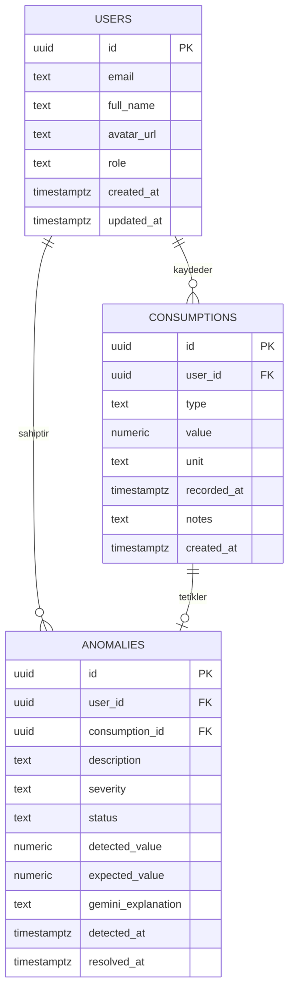

# Veritabanı Şeması — EcoSync AI

> **Proje:** EcoSync AI (Akıllı Ekosistem Platformu)  
> **Versiyon:** 1.0.0  
> **Tarih:** Mart 2026  
> **Veritabanı:** Supabase (PostgreSQL 15)  
> **Hazırlayan:** Mehmet Sefa İmamoğlu

---

## 1. Tablo Yapıları

### 1.1 `users` Tablosu

```sql
CREATE TABLE users (
  id          UUID DEFAULT gen_random_uuid() PRIMARY KEY,
  email       TEXT UNIQUE NOT NULL,
  full_name   TEXT,
  avatar_url  TEXT,
  role        TEXT NOT NULL DEFAULT 'user'
                   CHECK (role IN ('user', 'admin')),
  created_at  TIMESTAMPTZ NOT NULL DEFAULT NOW(),
  updated_at  TIMESTAMPTZ NOT NULL DEFAULT NOW()
);

-- Güncelleme zamanını otomatik tut
CREATE OR REPLACE FUNCTION update_updated_at()
RETURNS TRIGGER AS $$
BEGIN
  NEW.updated_at = NOW();
  RETURN NEW;
END;
$$ LANGUAGE plpgsql;

CREATE TRIGGER set_users_updated_at
  BEFORE UPDATE ON users
  FOR EACH ROW EXECUTE FUNCTION update_updated_at();
```

**Bütünlük Kuralları:**
- `email`: Benzersiz, boş bırakılamaz
- `role`: `'user'` veya `'admin'` değerlerinden biri olmalıdır
- `id`: `gen_random_uuid()` ile otomatik üretilir

---

### 1.2 `consumptions` Tablosu

```sql
CREATE TABLE consumptions (
  id          UUID DEFAULT gen_random_uuid() PRIMARY KEY,
  user_id     UUID NOT NULL REFERENCES users(id) ON DELETE CASCADE,
  type        TEXT NOT NULL
                   CHECK (type IN ('electricity', 'water', 'gas')),
  value       NUMERIC(12, 4) NOT NULL CHECK (value > 0),
  unit        TEXT NOT NULL
                   CHECK (unit IN ('kWh', 'litre', 'm3')),
  recorded_at TIMESTAMPTZ NOT NULL DEFAULT NOW(),
  notes       TEXT,
  created_at  TIMESTAMPTZ NOT NULL DEFAULT NOW()
);

-- Sık kullanılan sorgular için indeks
CREATE INDEX idx_consumptions_user_id     ON consumptions(user_id);
CREATE INDEX idx_consumptions_recorded_at ON consumptions(recorded_at DESC);
CREATE INDEX idx_consumptions_type        ON consumptions(type);

-- Tip-birim tutarlılığı kontrolü
ALTER TABLE consumptions ADD CONSTRAINT check_type_unit
  CHECK (
    (type = 'electricity' AND unit = 'kWh')   OR
    (type = 'water'       AND unit = 'litre') OR
    (type = 'gas'         AND unit = 'm3')
  );
```

**Bütünlük Kuralları:**
- `user_id`: Kullanıcı silindiğinde ilgili kayıtlar da silinir (CASCADE)
- `value`: Sıfırdan büyük olmalıdır
- `type` ve `unit`: Birbirleriyle tutarlı olmalıdır (constraint)

---

### 1.3 `anomalies` Tablosu

```sql
CREATE TABLE anomalies (
  id                 UUID DEFAULT gen_random_uuid() PRIMARY KEY,
  user_id            UUID NOT NULL REFERENCES users(id) ON DELETE CASCADE,
  consumption_id     UUID NOT NULL REFERENCES consumptions(id) ON DELETE CASCADE,
  description        TEXT NOT NULL,
  severity           TEXT NOT NULL
                          CHECK (severity IN ('low', 'medium', 'high', 'critical')),
  status             TEXT NOT NULL DEFAULT 'open'
                          CHECK (status IN ('open', 'acknowledged', 'resolved')),
  detected_value     NUMERIC(12, 4) NOT NULL,
  expected_value     NUMERIC(12, 4) NOT NULL,
  gemini_explanation TEXT,
  detected_at        TIMESTAMPTZ NOT NULL DEFAULT NOW(),
  resolved_at        TIMESTAMPTZ,

  -- İş kuralı: çözümlenmiş anomalinin resolved_at'i boş olamaz
  CONSTRAINT check_resolved_at
    CHECK (status != 'resolved' OR resolved_at IS NOT NULL),

  -- Her tüketim kaydına en fazla bir aktif anomali
  UNIQUE (consumption_id)
);

CREATE INDEX idx_anomalies_user_id    ON anomalies(user_id);
CREATE INDEX idx_anomalies_status     ON anomalies(status);
CREATE INDEX idx_anomalies_severity   ON anomalies(severity);
CREATE INDEX idx_anomalies_detected_at ON anomalies(detected_at DESC);
```

**Bütünlük Kuralları:**
- `resolved_at`: `status = 'resolved'` ise zorunludur
- `consumption_id`: Her tüketim için en fazla bir anomali (UNIQUE)

---

## 2. ER Diyagramı



---

## 3. Row Level Security (RLS) Politikaları

```sql
-- RLS'i tüm tablolarda etkinleştir
ALTER TABLE users        ENABLE ROW LEVEL SECURITY;
ALTER TABLE consumptions ENABLE ROW LEVEL SECURITY;
ALTER TABLE anomalies    ENABLE ROW LEVEL SECURITY;

-- users: Herkes kendi profilini okuyabilir ve güncelleyebilir
CREATE POLICY "users_own_data" ON users
  USING (auth.uid() = id);

-- consumptions: Kullanıcı yalnızca kendi kayıtlarına erişebilir
CREATE POLICY "consumptions_own_data" ON consumptions
  USING (auth.uid() = user_id);

CREATE POLICY "consumptions_insert_own" ON consumptions
  FOR INSERT WITH CHECK (auth.uid() = user_id);

-- anomalies: Kullanıcı yalnızca kendi anomalilerini görebilir
CREATE POLICY "anomalies_own_data" ON anomalies
  USING (auth.uid() = user_id);

-- Admin: Tüm anomali verilerini okuyabilir
CREATE POLICY "admin_read_anomalies" ON anomalies
  FOR SELECT USING (
    EXISTS (
      SELECT 1 FROM users
      WHERE users.id = auth.uid()
        AND users.role = 'admin'
    )
  );
```

---

## 4. Yararlı Sorgular

### Aylık Tüketim Özeti

```sql
SELECT
  type,
  DATE_TRUNC('month', recorded_at) AS month,
  SUM(value)                        AS total_value,
  AVG(value)                        AS avg_value,
  COUNT(*)                          AS record_count
FROM consumptions
WHERE user_id = $1
  AND recorded_at >= NOW() - INTERVAL '6 months'
GROUP BY type, month
ORDER BY month DESC, type;
```

### Açık Anomali Sayısı (Şiddet Bazında)

```sql
SELECT severity, COUNT(*) AS count
FROM anomalies
WHERE user_id = $1
  AND status = 'open'
GROUP BY severity
ORDER BY
  CASE severity
    WHEN 'critical' THEN 1
    WHEN 'high'     THEN 2
    WHEN 'medium'   THEN 3
    WHEN 'low'      THEN 4
  END;
```

---

## 5. Örnek Veri (Seed)

```sql
-- Test kullanıcısı
INSERT INTO users (id, email, full_name, role)
VALUES (
  'a0000000-0000-0000-0000-000000000001',
  'test@ecosync.app',
  'Test Kullanıcısı',
  'user'
);

-- Örnek tüketim kayıtları
INSERT INTO consumptions (user_id, type, value, unit, recorded_at)
VALUES
  ('a0000000-0000-0000-0000-000000000001', 'electricity', 45.2,  'kWh',   NOW() - INTERVAL '1 day'),
  ('a0000000-0000-0000-0000-000000000001', 'electricity', 212.8, 'kWh',   NOW()),          -- anomali
  ('a0000000-0000-0000-0000-000000000001', 'water',       320.0, 'litre', NOW() - INTERVAL '2 days'),
  ('a0000000-0000-0000-0000-000000000001', 'gas',         12.5,  'm3',    NOW() - INTERVAL '3 days');
```
